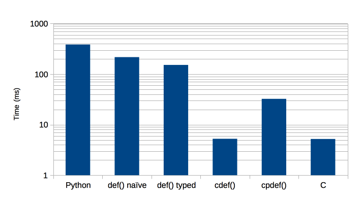
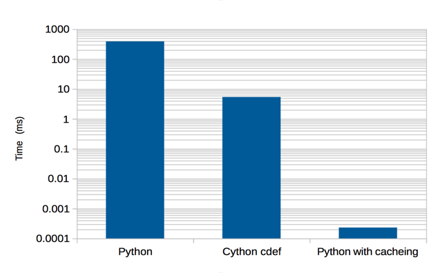
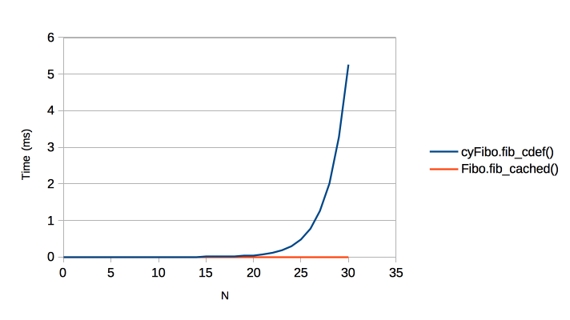

.. highlight:: python
    :linenothreshold: 10

.. toctree::
    :maxdepth: 3

==============================================================
How Fast are ``def`` ``cdef`` ``cpdef``?
==============================================================

Code Example
---------------------

Here is an example of computing the Fibonacci series (badly) that will be done in Python, Cython and C.

First up, Python [*Fibo.py*]::

    def fib(n):
        if n < 2:
            return n
        return fib(n-2) + fib(n-1)

In naive Cython [*cyFibo.pyx*], it is the same code::

    def fib(n):
        if n < 2:
            return n
        return fib(n-2) + fib(n-1)

Optimised Cython where we specify the argument type [*cyFibo.pyx*]::

    def fib_int(int n):
        if n < 2:
            return n
        return fib_int(n-2) + fib_int(n-1)

In Cython calling C generated code. Here we use a ``def`` to call a ``cdef`` that does the body of the work [*cyFibo.pyx*]::

    def fib_cdef(int n):
        return fib_in_c(n)

    cdef int fib_in_c(int n):
        if n < 2:
            return n
        return fib_in_c(n-2) + fib_in_c(n-1)

Now a recursive ``cpdef`` returning a python object::

    cpdef fib_cpdef(int n):
        if n < 2:
            return n
        return fib_cpdef(n-2) + fib_cpdef(n-1)

A recursive ``cpdef`` returning an int::

    cpdef int fib_typed_cpdef(int n):
        if n < 2:
            return n
        return fib_typed_cpdef(n-2) + fib_typed_cpdef(n-1)

Finally a C extension. We expect this to be the fastest way of computing the result given the algorithm we have chosen:

.. literalinclude:: ../../src/cFiboExt.c
   :language: c

Benchmarks
-------------------

First a correctness check on the methods::

    python -m unittest discover

Now time these algorithms on Fibonacci(30) thus::

    python fibo_bench.py

Gives:

======== ============================ =============   =================
Language Function call                Time (ms)       Speed, Python = 1
======== ============================ =============   =================
Python   ``Fibo.fib(30)``             571             x1
Cython   ``cyFibo.fib(30)``           229             x2.5
Cython   ``cyFibo.fib_int(30)``       165             x3.5
Cython   ``cyFibo.fib_cdef(30)``      7.31            x78
Cython   ``cyFibo.fib_cpdef(30)``     39.6            x14
Cython   ``cyFibo.fib_int cpdef(30)`` 5.61            x102
C        ``cFibo.fib(30)``            6.75            x85
======== ============================ =============   =================

Graphically:

The conclusions that I draw from this are:

* Naive Cython does speed things up, but not by much (x2.5).
* Optimised Cython is fairly effortless (in this case) and worthwhile
  (x3.5).
* ``cpdef`` gives a good improvement over ``def`` because the
  recursive case exploits C functions.
* ``cdef`` is really valuable (x78).
* Cython's ``cdef`` is insignificantly different from the more
  complicated C extension that is our best attempt.
* ``typed cpdef`` gives the best of two worlds and (in our example) it
  is even faster than the hand wrapping of the C function.

The Importance of the Algorithm
-------------------------------------

So far we have looked at pushing code into Cython/C to get a
performance gain however there is a glaring error in our code. The
algorithm we have been using is **very** inefficient. Here is
different algorithm, in pure Python, that will beat all of those above
by a huge margin [#]_:

.. code-block:: python

    def fib_cached(n, cache={}):
        if n < 2:
            return n
        try:
            val = cache[n]
        except KeyError:
            val = fib_cached(n-2) + fib_cached(n-1)
            cache[n] = val
        return val

And timing it for Fibonacci(30) gives:

======== =========================== =============   ===========
Language Function call               Time (ms)       Improvement
======== =========================== =============   ===========
Python   ``Fibo.fib(30)``            390             x1
Cython   ``cyFibo.fib_cdef(30)``     5.38            x72
Python   ``Fibo.fib_cached(30)``     0.000231        x1.7e6
======== =========================== =============   ===========

Or, graphically:

In fact our new algorithm is far, far better than that. Here is the
O(N) behaviour where N is the Fibonacci ordinal:

Hammering a bad algorithm with a fast language is worse than using a
good algorithm and a slow language.

.. rubric:: Footnotes

.. [#] If you are using Python3 you can use the
       ``functools.lru_cache`` decorator that gives you more control
       over cache behaviour.
