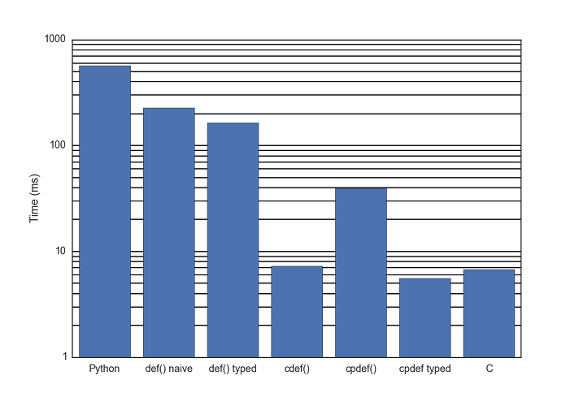

.. highlight:: python
    :linenothreshold: 10

.. toctree::
    :maxdepth: 3

==============================================================
How Fast are ``def`` ``cdef`` ``cpdef``?
==============================================================

Code Example
---------------------

Here is an example of computing the Fibonacci series (badly) that will be done in Python, Cython and C.

First up, Python [*Fibo.py*]::

    def fib(n):
        if n < 2:
            return n
        return fib(n-2) + fib(n-1)

In naive Cython [*cyFibo.pyx*], it is the same code::

    def fib(n):
        if n < 2:
            return n
        return fib(n-2) + fib(n-1)

Optimised Cython where we specify the argument type [*cyFibo.pyx*]::

    def fib_int(int n):
        if n < 2:
            return n
        return fib_int(n-2) + fib_int(n-1)

In Cython calling C generated code. Here we use a ``def`` to call a ``cdef`` that does the body of the work [*cyFibo.pyx*]::

    def fib_cdef(int n):
        return fib_in_c(n)

    cdef int fib_in_c(int n):
        if n < 2:
            return n
        return fib_in_c(n-2) + fib_in_c(n-1)

Now a recursive ``cpdef``::

    cpdef int fib_cpdef(int n):
        if n < 2:
            return n
        return fib_cpdef(n-2) + fib_cpdef(n-1)

Finally a C extension. We expect this to be the fastest way of computing the result given the algorithm we have chosen:

.. code-block:: c

    #include "Python.h"

    /* This is the function that actually computes the Fibonacci value. */
    static long c_fibonacci(long ord) {
        if (ord < 2) {
            return ord;
        }
        return c_fibonacci(ord - 2) + c_fibonacci(ord -1);
    }

    /* The Python interface to the C code. */
    static PyObject *python_fibonacci(PyObject *module, PyObject *arg) {
        PyObject *ret = NULL;
        assert(arg);
        Py_INCREF(arg);
        if (! PyLong_CheckExact(arg)) {
            PyErr_SetString(PyExc_ValueError, "Argument is not an integer.");
            goto except;
        }
        long ordinal = PyLong_AsLong(arg);
        long result = c_fibonacci(ordinal);
        ret = PyLong_FromLong(result);
        assert(! PyErr_Occurred());
        assert(ret);
        goto finally;
    except:
        Py_XDECREF(ret);
        ret = NULL;
    finally:
        Py_DECREF(arg);
        return ret;
    }

    /********* The rest is standard Python Extension code ***********/

    static PyMethodDef cFiboExt_methods[] = {
    {"fib", python_fibonacci, METH_O, "Fibonacci value."},
    {NULL, NULL, 0, NULL}           /* sentinel */
    };

    #if PY_MAJOR_VERSION >= 3

    /********* PYTHON 3 Boilerplate ***********/

    PyDoc_STRVAR(module_doc, "Fibonacci in C.");

    static struct PyModuleDef cFiboExt = {
    PyModuleDef_HEAD_INIT,
    "cFibo",
    module_doc,
    -1,
    cFiboExt_methods,
    NULL,
    NULL,
    NULL,
    NULL
    };

    PyMODINIT_FUNC
    PyInit_cFibo(void)
    {
    return PyModule_Create(&cFiboExt);
    }

    #else

    /********* PYTHON 2 Boilerplate ***********/

    PyMODINIT_FUNC
    initcFibo(void)
    {
    (void) Py_InitModule("cFibo", cFiboExt_methods);
    }

    #endif

Benchmarks
-------------------

First a correctness check on Fibonacci(30)::

    $ python3 -c "import Fibo, cyFibo, cFibo; print(Fibo.fib(30) == cyFibo.fib(30) == cyFibo.fib_int(30) == cyFibo.fib_cdef(30) == cyFibo.fib_cpdef(30) == cFibo.fib(30))"
    True

Now time these algorithms on Fibonacci(30) thus::

    $ python3 -m timeit -s "import Fibo" "Fibo.fib(30)"
    $ python3 -m timeit -s "import cyFibo" "cyFibo.fib(30)"
    $ python3 -m timeit -s "import cyFibo" "cyFibo.fib_int(30)"
    $ python3 -m timeit -s "import cyFibo" "cyFibo.fib_cdef(30)"
    $ python3 -m timeit -s "import cyFibo" "cyFibo.fib_cpdef(30)"
    $ python3 -m timeit -s "import cFibo" "cFibo.fib(30)"

Gives:

======== =========================== =============   =================
Language Function call               Time (ms)       Speed, Python = 1
======== =========================== =============   =================
Python   ``Fibo.fib(30)``            390             x 1
Cython   ``cyFibo.fib(30)``          215             x 1.8
Cython   ``cyFibo.fib_int(30)``      154             x 2.5
Cython   ``cyFibo.fib_cdef(30)``     5.38            x72
Cython   ``cyFibo.fib_cpdef(30)``    5.45            x72
C        ``cFibo.fib(30)``           5.31            x73
======== =========================== =============   =================

Graphically:

The conclusions that I draw from this are:

* Naive Cython does speed things up, but not by much (x1.8).
* Optimised Cython is fairly effortless (in this case) and worthwhile (x2.5).
* ``cdef`` is really valuable (x72).
* ``cpdef`` gives a good improvement over ``def`` because the recursive case exploits C functions.
* Cython's ``cdef`` is insignificantly different from the more complicated C extension that is our best attempt.

The Importance of the Algorithm
-------------------------------------

So far we have looked at pushing code into Cython/C to get a performance gain however there is a glaring error in our code. The algorithm we have been using is **very** inefficient. Here is different algorithm, in pure Python, that will beat all of those above by a huge margin [#]_:

.. code-block:: python

    def fib_cached(n, cache={}):
        if n < 2:
            return n
        try:
            val = cache[n]
        except KeyError:
            val = fib(n-2) + fib(n-1)
            cache[n] = val
        return val

And timing it for Fibonacci(30) gives:

======== =========================== =============   ===========
Language Function call               Time (ms)       Improvement
======== =========================== =============   ===========
Python   ``Fibo.fib(30)``            390             x1
Cython   ``cyFibo.fib_cdef(30)``     5.38            x72
Python   ``Fibo.fib_cached(30)``     0.000231        x1.7e6
======== =========================== =============   ===========

Or, graphically:

.. image:: images/CacheComparison.png

In fact our new algorithm is far, far better than that. Here is the O(N) behaviour where N is the Fibonacci ordinal:

.. image:: images/CacheON.png

Hammering a bad algorithm with a fast language is worse than using a good algorithm and a slow language.

.. rubric:: Footnotes

.. [#] If you are using Python3 you can use the ``functools.lru_cache`` decorator that gives you more control over cache behaviour.
