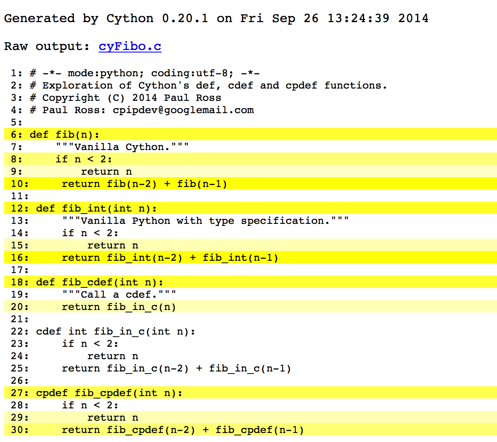
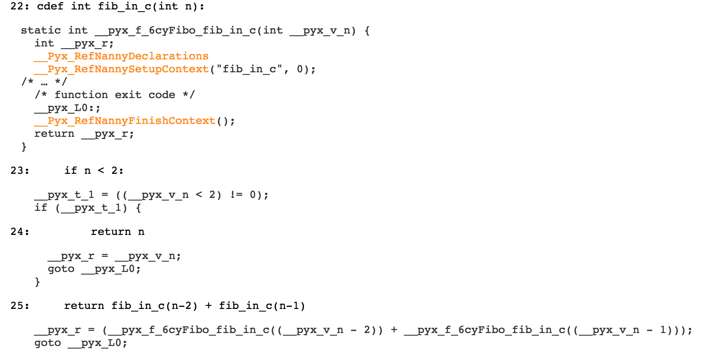

Miscellaneous Notes
====================

Annotating Code to HTML
--------------------------

Cython has a ``-a`` option which generates an HTML page showing both the Cython code and the C code. It is invoked thus::

    $ cython -z cyFibo.pyx

Here is a screenshot of the result. It is colour annotated to show the complexity of the conversion, the more lines of C generated for each line of Cython the darker the shade of yellow:

Clicking on the line numbers expands to reveal the actual C code generated, here all the lines for ``fib_in_c()`` have been selected:

Cython's C code is fairly obfusticated but once you can see The Lady in Red you can call yourself a Cython Ninja.
